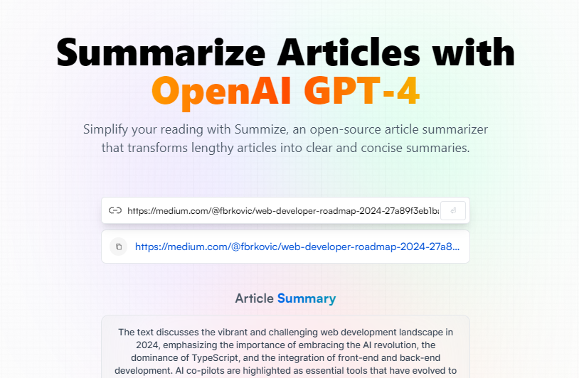

# AI Summarizer

This is a project that uses the Article Extractor and Summarizer API which extracts news/article body from a URL and uses GPT to summarize (and optionally translate) the article content. 

## How To Get Started

### Install Dependencies

To install all the dependencies required to run the app run npm install in the project directory.

### Add your API Key

Change the `API_KEY` variable in .env to your API key. You can create one on https://rapidapi.com/restyler/api/article-extractor-and-summarizer.

### Start the App
`npm run dev` runs the app in the development mode.